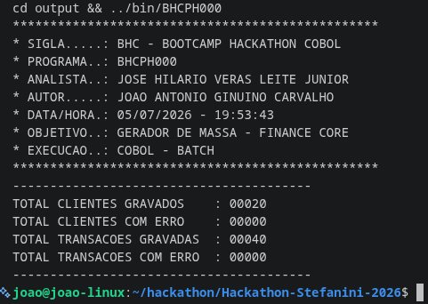
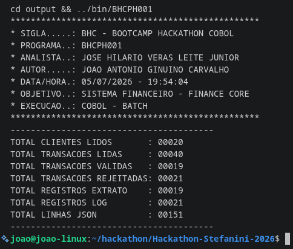
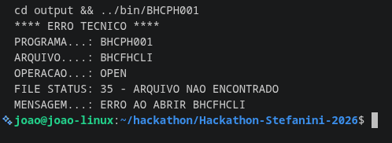
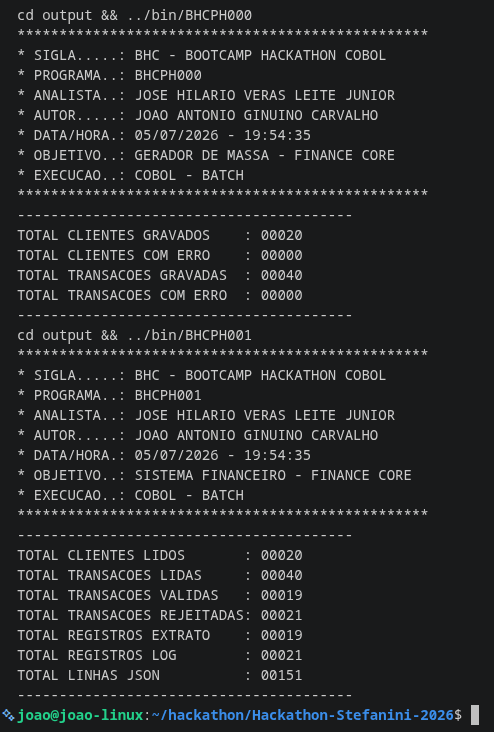

<div align="center">

# Hackathon Stefanini 2026 - Bootcamp COBOL

**Do `DISPLAY` mais simples a um sistema financeiro batch completo em COBOL**

[](https://github.com/i-JSS/Hackathon-Stefanini-2026)
[](https://gnucobol.sourceforge.io/)
[](#-padrão-de-codificação)
[](#-o-desafio-sistema-financeiro-finance-core)
[](Makefile)
[](#-mapa-dos-programas)
[](LICENSE)

</div>

---

## Sobre o projeto

Este repositório reúne todo o percurso do **Bootcamp Hackathon COBOL Stefanini 2026**: as
aulas práticas (`aulas/`), onde os fundamentos da linguagem foram construídos passo a passo,
e o **desafio final**, o **Finance Core**, um mini sistema financeiro batch completo
(`src/`, `copybooks/`, `bin/`, `output/`), que reúne tudo o que foi aprendido em um projeto
desacoplado por arquivos, com dois programas principais, um subprograma de regra de negócio,
6 copybooks compartilhados, tratamento de exceção de I/O ponta a ponta e build automatizado
via Makefile.

Todos os programas, das aulas ao desafio, seguem **um único padrão de escrita** (formato
fixo, cabeçalho padronizado, nomenclatura de variáveis e encerramento por `GOBACK`), definido
e aplicado de forma consistente do primeiro `DISPLAY` até o `BHCPH001`.

### Evidências de execução

<div align="center">



**Imagem 1 - Execução do `BHCPH000` (gerador de massa).** Grava os 20 clientes e as 40
transações sem nenhum erro; é essa execução que cria os arquivos `BHCFHCLI.txt` e
`BHCFHTRA.txt`, lidos depois pelo `BHCPH001`.

<br>



**Imagem 2 - Execução do `BHCPH001` (motor financeiro).** Processa os 20 clientes e as 40
transações geradas na etapa anterior, valida cada transação (19 aprovadas, 21 rejeitadas),
grava extrato e log, e gera as 151 linhas do JSON final, prova de que a regra de negócio
delegada ao `BHCSH001` e a geração dos três arquivos de saída funcionam.

<br>



**Imagem 3 - Tratamento de erro técnico (`FILE STATUS`).** Com o arquivo `BHCFHCLI` ausente,
o programa não trava nem termina em silêncio: identifica o `FILE STATUS 35` (arquivo não
encontrado), aciona a `800000-TRATAR-ERRO` e exibe programa, arquivo, operação e mensagem do
erro na `SYSOUT` antes de encerrar.

<br>



**Imagem 4 - Fluxo oficial completo (`make run`).** `BHCPH000` gera a massa (20 clientes, 40
transações, zero erros) e, em seguida, o `BHCPH001` processa tudo e chega ao mesmo resultado
da execução isolada (19 válidas, 21 rejeitadas, 151 linhas de JSON), evidência de que o
`make run` reproduz corretamente a ordem exigida no edital.

</div>

> As 5 evidências completas, incluindo o diagrama de arquitetura do sistema, estão reunidas
> em [`assets/PRINTS_EXPLICADOS.pdf`](assets/PRINTS_EXPLICADOS.pdf).

---

## O Desafio: Sistema Financeiro Finance Core

O desafio pedia um sistema batch em COBOL capaz de gerar sua própria massa de dados, validar
regras de negócio de clientes e transações, e produzir extrato, log de rejeições e um JSON
final, tudo rodando em disco, sem banco de dados, do jeito que um mainframe real conversa
entre steps de um job.

### O que foi feito

- **`BHCPH000`** - gera a massa oficial: grava os arquivos de clientes e transações que o
  sistema vai processar.
- **`BHCPH001`** - o motor financeiro: lê a massa gerada pelo `BHCPH000`, aplica a regra de
  negócio e produz extrato, log e JSON.
- **`BHCSH001`** - subprograma de validação (cliente existe, está ativo, tipo de transação,
  valor, saldo), chamado via `CALL` e `LINKAGE SECTION` a partir do `BHCPH001`.
- **6 copybooks compartilhados**, `BHCCLIEN`, `BHCTRAXX`, `BHCEXTXX`, `BHCLOGXX`,
  `BHCPARAM` e `BHCJSONX`, para não repetir layout de arquivo em cada programa.

O `BHCPH000` **nunca chama o `BHCPH001` diretamente**: a comunicação entre os dois programas
é 100% via arquivo `LINE SEQUENTIAL` em disco. Toda a regra de negócio fica isolada no
`BHCSH001`, mantendo o programa principal enxuto e a validação reaproveitável em outro lugar
sem duplicar código.

### Estrutura de pastas e Makefile

O projeto do desafio é organizado em 4 pastas, cada uma mapeada numa variável do `Makefile`:

| Pasta        | Variável | Conteúdo                                                                    |
|--------------|----------|-----------------------------------------------------------------------------|
| `src/`       | `SRC`    | Fontes `.cbl` (`BHCPH000`, `BHCPH001`, `BHCSH001`)                          |
| `copybooks/` | `COPY`   | Copybooks compartilhados entre os programas                                 |
| `bin/`       | `BIN`    | Executáveis e o objeto `BHCSH001.o` gerados na compilação                   |
| `output/`    | `OUT`    | Pasta onde os programas rodam e onde os `.txt`/`.json` são lidos e gravados |

`bin/` guarda artefato de compilação (binário) e `output/` guarda artefato de execução
(dado), separados de propósito, para não misturar código compilado com massa gerada em
tempo de execução e permitir limpar cada um de forma independente.

No alvo `compile`, o Makefile limpa tudo antes (`clean`), recria `bin/` e `output/`, compila
o `BHCPH000` como executável (`-x`), compila o `BHCSH001` só como objeto (`-c`, porque é
subprograma e nunca roda sozinho) e por fim compila o `BHCPH001` já linkando o
`BHCSH001.o`, é esse link que faz o `CALL BHCSH001` funcionar dentro do `BHCPH001`. Os
alvos `BHCPH000`, `BHCPH001` e `run` sempre dependem de `compile`, então nunca se corre o
risco de rodar um binário desatualizado. A execução acontece de dentro de `output/`, porque
os `SELECT` usam caminho relativo (ex.: `BHCFHCLI.txt`). O alvo `run` automatiza a sequência
oficial do desafio: primeiro o `BHCPH000`, depois o `BHCPH001`.

```bash
make run       # compila tudo e roda BHCPH000 -> BHCPH001, na ordem oficial
make compile   # só compila (clean + bin/ + output/ + link do BHCSH001.o)
make BHCPH000  # compila e roda só o gerador de massa
make BHCPH001  # compila e roda o fluxo completo (garante BHCPH000 antes)
make clean     # remove bin/ e output/
```

### Decisões arquiteturais

- **Separação de responsabilidades**: quem lê e grava arquivo fica no programa principal,
  quem valida regra de negócio fica isolado no subprograma, o que permite trocar a fonte de
  dados no futuro (arquivo, DB2, CICS) sem tocar na validação.
- **Build multiplataforma** (Windows, Linux e Mac), com `bin/` separado de `output/` e o
  `make run` reproduzindo o fluxo oficial na ordem certa.
- **`FILE STATUS` próprio** para os 5 arquivos (`CLI`, `TRA`, `EXT`, `LOG`, `JSN`), validado
  numa `SECTION` dedicada (`810000-VALIDAR-FS`) via `EVALUATE`. Qualquer código fora do
  esperado aciona a `800000-TRATAR-ERRO`, que imprime programa, arquivo, operação e status
  antes de encerrar com `GOBACK`. Todos os códigos de exceção de I/O previstos no desafio
  (`00, 10, 35, 37, 39, 41, 42, 46, 47, 48, 49` e `OTHER`) são capturados e tratados.
- **Diagrama conferido contra o código-fonte**: o fluxo `BHCPH000` gerando `BHCFHCLI` e
  `BHCFHTRA` → `BHCPH001` lendo esses arquivos, chamando o `BHCSH001` e gerando `BHCFHEXT`,
  `BHCFHLOG` e `BHCFHJSN` bate exatamente com os `SELECT/ASSIGN TO` e o `CALL` presentes nos
  fontes `.cbl`.


### JCL, DB2 e CICS (nível conceitual)

O desafio pede apenas contexto conceitual para esses três temas, sem exigir código. É assim
que cada um se encaixaria no projeto:

| Tema     | Papel no mainframe                                                                 | Equivalente hoje                                                              | Como evoluiria                                                                                                                                                                                                                                       |
|----------|------------------------------------------------------------------------------------|-------------------------------------------------------------------------------|------------------------------------------------------------------------------------------------------------------------------------------------------------------------------------------------------------------------------------------------------|
| **JCL**  | Manda o z/OS executar os programas COBOL, um atrás do outro, na ordem certa        | O `Makefile` garante que o `BHCPH000` rode antes do `BHCPH001`                | Num z/OS real, a orquestração sairia do Makefile e passaria a ser feita pelo JCL, chamando cada programa como um step do job                                                                                                                         |
| **DB2**  | Banco relacional da IBM: dados em tabelas em vez de arquivo sequencial             | `BHCPH001` lê cadastro de clientes e transações de arquivos `LINE SEQUENTIAL` | Os dois arquivos virariam tabelas; `OPEN/READ` daria lugar a `EXEC SQL` (`SELECT`, `INSERT`, `UPDATE`, `DELETE`) com host variables via `INTO`, cursor (`DECLARE CURSOR`/`FETCH`) no lugar do laço de leitura, e `SQLCODE` no lugar do `FILE STATUS` |
| **CICS** | Ambiente online do mainframe, atende uma transação por vez (ao contrário do batch) | O projeto é 100% batch                                                        | Uma consulta em tempo real, como saldo de cliente, poderia virar uma transação CICS rodando ao lado do batch, sem mexer no que já existe                                                                                                             |

---

## Estrutura do repositório

```text
Hackathon-Stefanini-2026/
├── assets/                     # Prints, PDF explicativo e resenha do desafio
│   ├── BHCPH000.png
│   ├── BHCPH001.png
│   ├── tratamento_erro.png
│   ├── PROJETO_INTEIRO.png
│   └── PRINTS_EXPLICADOS.pdf
│
├── src/                         # Desafio final: Finance Core
│   ├── BHCPH000.cbl            # Gerador da massa oficial (clientes + transações)
│   ├── BHCPH001.cbl            # Motor financeiro (lê massa, chama BHCSH001, gera saídas)
│   └── BHCSH001.cbl            # Subprograma de validação de regra de negócio
│
├── copybooks/                   # Layouts compartilhados do desafio
│   ├── BHCCLIEN.cpy            # Layout de cliente
│   ├── BHCTRAXX.cpy            # Layout de transação
│   ├── BHCEXTXX.cpy            # Layout do extrato
│   ├── BHCLOGXX.cpy            # Layout do log de rejeições
│   ├── BHCPARAM.cpy            # LINKAGE SECTION do CALL BHCSH001
│   └── BHCJSONX.cpy            # Layout do JSON final
│
├── bin/                         # Gerado pelo make: executáveis + BHCSH001.o
├── output/                      # Gerado pelo make: massa e saídas do desafio
│
├── aulas/
│   ├── Aula-1/                  # Fundamentos: DISPLAY, MOVE, ADD
│   ├── Aula-2/                  # Estruturas de decisão e cadastros simples
│   ├── Aula-3/                  # Arrays (OCCURS / OCCURS DEPENDING ON)
│   ├── Aula-4/                  # Mini sistema batch: arquivos + sub-programas
│   ├── Aula-5/                  # Processamento de lançamentos e totalizadores
│   └── Aula-6/                  # Integração com formatos modernos (JSON manual)
│
├── Makefile                     # Build do desafio (compile / BHCPH000 / BHCPH001 / run / clean)
└── LICENSE
```

---

## Como compilar e executar

### Desafio (Finance Core)

Pré-requisito: [GnuCOBOL](https://gnucobol.sourceforge.io/) instalado (`cobc`).

```bash
# Fluxo oficial completo: compila tudo e roda BHCPH000 -> BHCPH001
make run
```

```bash
# Passo a passo, se preferir
make compile     # clean + cria bin/ e output/ + compila e linka os 3 programas
make BHCPH000    # roda só o gerador de massa
make BHCPH001    # roda o fluxo completo (garante que o BHCPH000 já rodou antes)
make clean       # remove bin/ e output/
```

### Aulas

```bash
# Exemplo com o programa da Aula 6
cd aulas/Aula-6
cobc -x -o BHCP0016 BHCP0016.cbl
./BHCP0016
```

Para programas com sub-programa (`CALL`), compile o sub-programa como módulo antes do
principal:

```bash
# Exemplo: Aula 4 - BHCP0014 chama BHCS0014
cd aulas/Aula-4
cobc -m BHCS0014.cbl          # gera BHCS0014.so / .dll (módulo dinâmico)
cobc -x -o BHCP0014 BHCP0014.cbl
./BHCP0014
```

---

## Padrão de codificação

Todos os programas das aulas ao desafio final seguem o **mesmo padrão fixo do
bootcamp**:

- **Formato fixo** (não `-free`): `DIVISION`/`SECTION` na Área A (colunas 8–11), sentenças
  na Área B (colunas 12–72).
- **Cabeçalho padronizado** em todo `.cbl`, com `SIGLA`, `PROGRAMA`, `ANALISTA`, `AUTOR`,
  `DATA`, `OBJETIVO`, `EXECUCAO` e histórico de versões.
- **`PROGRAM-ID`** com até 8 caracteres, igual ao nome do arquivo (`BHCPxxxx` para
  programas, `BHCSxxxx` para sub-programas).
- **Encerramento sempre com `GOBACK`**, o uso de `STOP RUN` é proibido no bootcamp.
- **`DECIMAL-POINT IS COMMA`** fixado na `CONFIGURATION SECTION`.
- **Convenção de nomes**: `GDA-` (áreas de guarda/globais), `LK-` (`LINKAGE SECTION`),
  `1000-`/`2000-`/`3000-`/`8xxxxx-`/`9000-` (parágrafos de inicialização, processamento,
  finalização e tratamento de erro).

---

## Créditos

| Papel                 | Nome                            |
|-----------------------|---------------------------------|
| Analista              | José Hilario Veras Leite Junior |
| Autor / Desenvolvedor | João Antonio Ginuino Carvalho   |

---

<div align="center">

**Bootcamp Hackathon COBOL Stefanini 2026**

</div>